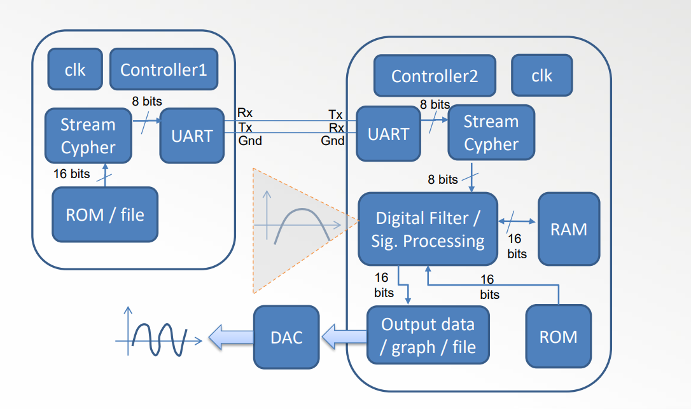

# VHDL
This repository has 5 works for the **reconfigurable engineering** subject of the Universidade do Algarve. The works are:

1. **VHDL Sequence detector**: A simple VHDL code that implements a sequence detector for the sequence 100101.

2. **VHDL Cypher**: A simple VHDL code that implements a simple cypher that uses an LFSR to generate a key and a simple XOR to encrypt the data. The key is generated using a linear feedback shift register (LFSR), and the data is encrypted using a simple XOR operation with the key.

3. **VHDL Filter**: A simple VHDL code that implements a filtering process for a noisy signal. The filter uses calculations of a specific filter and the noise signal.

4. **VHDL UART**: A simple VHDL code that implements a UART (Universal Asynchronous Receiver-Transmitter) module. The UART module is used for serial communication between two devices. It converts parallel data into serial data for transmission and vice versa.

5. **FINAL WORK**: A complex controller VHDL code that implements all the important components of the other works and follows this architecture:

    

